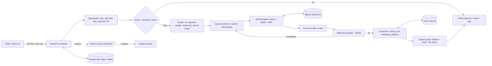

# PRODUCTION RAG PLATFORM — Build Spec for Claude Code

> Hand this file to Claude Code as the single source of truth. Read ALL of it before writing code.
> Spec date: 2026-10-03. Free-tier limits below were checked on that date and **change often** — Claude Code must re-verify any limit it depends on (Render, Qdrant Cloud, Grafana Cloud) against the vendor docs before relying on it.

---

## 0. Working agreement (Claude Code, read first)

1. **The human owns accounts, API keys and spending.** Never ask them to paste secrets into chat. Use `.env` (git-ignored) + `.env.example`. If a step needs a human action, stop and print it from Section 2 as a clear `HUMAN ACTION NEEDED` block.
2. **Never commit secrets.** Add a pre-commit secret scan (`gitleaks`) in Milestone 0.
3. **Never fabricate numbers.** Every metric in README/RESULTS (latency, cost, recall, faithfulness) must come from a real run of the eval harness or load test, with the command and date recorded. If not measured yet, write `TBD (not measured)`.
4. **Spend discipline.** Any script that calls the paid LLM must (a) support `--dry-run` that prints estimated tokens/cost, (b) enforce a hard `--max-usd` cap, (c) log actual cost. Ask the human before any run estimated above **$2**.
5. **Memory budget: the serving container must stay under ~400 MB RSS** (Render free = 512 MB). Measure it (Milestone 3) and record it. **Allowed orchestration/observability libs:** `langgraph` (agent loop only) and, optionally, the `langsmith` SDK (Section 13.5). **Not allowed in the serving image:** `langchain` (the umbrella package, chains, retrievers, vector-store wrappers), `langchain-community`, LlamaIndex, LiteLLM, torch, transformers, spaCy. LangGraph go/no-go rule: measure RSS with and without it in M3; if the app can't stay under ~400 MB with LangGraph, switch to the plain-Python state machine fallback (Section 4.1) and record an ADR.
6. **Small, reviewable commits**, one milestone at a time. After each milestone: run tests + lint + type-check, update docs, and report what's done vs. the milestone's acceptance criteria.
7. Write an ADR (`docs/adr/NNNN-title.md`, 10–25 lines: context / decision / alternatives / consequences) for each major choice. Interviewers love these.
8. If something here is wrong or infeasible, say so and propose a change instead of silently deviating.

---

## 1. What we're building and why it stands out

**Name (working):** `atlas-rag` — a production-grade, observable, cost-aware, secured RAG API + small demo UI, deployed live on Render.

**Default corpus (configurable):** open-access arXiv papers on LLMs / retrieval / RAG (arXiv API needs no key). Rich in multi-hop questions ("which paper introduced X and what did a later paper change about it?"), free, and a "RAG that answers questions about RAG" demo is memorable. Corpus is a config choice; do not hardcode the domain.

**The pitch (what a hiring manager should see in 60 seconds):**
- Live URL with a streaming demo that **shows its work** (route chosen, hops, retrieval grading, cache hit/miss, latency, $ cost per query).
- A **Grafana dashboard** (Prometheus metrics) showing real traffic: stage latencies, cache hit ratios, cost per route, guard blocks, circuit-breaker state.
- An **ablation table** from a real evaluation harness: dense-only → hybrid → +rerank → +contextual → +corrective → +multi-hop, each with quality, latency and cost.
- A **security table** mapped to the OWASP Top 10 for LLM Applications, with tests proving each control.
- A **LangGraph-orchestrated agent loop** with an auto-generated graph diagram in the README, plus optional **LangSmith** per-request traces and eval runs next to Prometheus system metrics.
- ADRs, CI with an eval gate, and honest "limitations" section.

### 1.1 One project or two? (decision)

**Recommendation: build ONE flagship project (this spec) first. Add a second, smaller project only after the flagship is live and documented.**

- Depth with evidence (live demo + metrics + ablations + tests) beats several shallow repos; reviewers skim, and a polished flagship is what gets remembered.
- Do **not** merge GraphRAG into the flagship: graph indexing needs LLM entity/relation extraction (expensive), extra storage, and risks the 512 MB RAM ceiling. Keep the flagship focused: hybrid + rerank + contextual + adaptive routing + corrective + multi-hop decomposition.
- **Project B (optional, Section 19):** a smaller GraphRAG / multi-hop project over a different domain that **reuses the same chassis** (auth, cache, metrics, error handling, CI) extracted as a template. That shows range (a second retrieval paradigm) without doubling the effort.

---

## 2. HUMAN SETUP CHECKLIST (the human does these; Claude Code reminds them at the right milestone)

### 2.1 Tools on the human's machine
- Python 3.12+, `uv` (or pip), Docker Desktop, Git, a GitHub account.
- Optional: `k6` or Locust for load testing.

### 2.2 Accounts and keys (all free except the LLM)

| # | Service | What to do | What to give Claude Code (via `.env` only) | Needed by |
|---|---|---|---|---|
| 1 | **LLM provider** (paid) — Anthropic *or* OpenAI | Create an API key in the provider console. **Set a monthly spend limit in the console** (this is the real backstop against runaway cost). Fill `pricing.yaml` from the provider's current pricing page (per 1M input/output/cached tokens). | `ANTHROPIC_API_KEY` (or `OPENAI_API_KEY`), model ids `LLM_CHEAP_MODEL`, `LLM_STRONG_MODEL` | M1 |
| 2 | **Qdrant Cloud** (free cluster) | Sign up at cloud.qdrant.io → create a Free cluster (1 GB RAM / 0.5 vCPU / 4 GB disk, no card). Pick the region closest to your Render region (EU users: Frankfurt, if offered). Copy cluster URL + API key. **Free clusters suspend after 1 week of inactivity and are deleted after 4 weeks** — the health/scrape traffic in Section 13 keeps it alive; also keep a local snapshot of the corpus (ingestion is reproducible). | `QDRANT_URL`, `QDRANT_API_KEY` | M1 |
| 3 | **Render** (free "Hobby") | Sign up, connect GitHub. Create a **Key Value** (Redis-compatible) instance, plan **Free** (25 MB, *not persistent*), same region as the web service. Copy its **internal** URL for the web service and the external URL for local testing if allowed. Deploy via the `render.yaml` Blueprint (Section 16). | `REDIS_URL` (set in Render dashboard, not in git) | M2 (Redis local via Docker), M7 (deploy) |
| 4 | **Grafana Cloud** (free) | Sign up (no card) → create a stack. In **Connections → Metrics Endpoint**, create a scrape job: URL `https://<your-service>.onrender.com/metrics`, auth **Bearer**, token = your `METRICS_BEARER_TOKEN` (enter the token without the word "Bearer"). Interval: see Section 13.4. Then import `ops/grafana/atlas-dashboard.json`. Free tier: 10k active series, 14-day retention, 3 users. | `METRICS_BEARER_TOKEN` (you generate it, step 5) | M6 |
| 5 | **Secrets you generate yourself** | `python -c "import secrets; print(secrets.token_urlsafe(32))"` — run 4 times for: `METRICS_BEARER_TOKEN`, `ADMIN_TOKEN`, `API_KEY_PEPPER`, and one raw demo API key (Claude Code provides a script `scripts/make_api_key.py` that prints the raw key once and the hash to put in `API_KEYS_JSON`). | `.env` + Render env vars | M4 |
| 6 | **GitHub repo** (public) | Create repo; enable Actions; add secrets only if you want the *manual* full-eval workflow to run in CI (`ANTHROPIC_API_KEY`). PR/CI checks must NOT need paid keys. | repo URL | M0 |
| 7 | *(Optional but recommended)* **LangSmith** (free Developer plan) | Sign up at smith.langchain.com → create an API key and a project named `atlas-rag`. Free plan (checked 2026-10-03): 1 seat, ~5,000 base traces/month, 14-day retention — **re-verify**; sources differ on how multi-step runs are counted, so we sample (Section 13.5). Do NOT add a credit card unless you want overage billing. | `LANGSMITH_API_KEY`, `LANGSMITH_PROJECT`, `LANGSMITH_TRACING` | M6 |
| 8 | *(Optional)* **Cohere trial key** | Only if you want to benchmark a hosted reranker as an alternative backend. Trial keys are rate-limited and not for production use. | `COHERE_API_KEY` | stretch |
| 9 | *(Optional)* Free uptime pinger (e.g., UptimeRobot) | Only if you choose not to use the Grafana scrape as a keep-alive (Section 13.4). | — | M7 |

### 2.3 Environment variables (`.env.example` must contain all of these with comments)

```
APP_ENV=dev|prod
LOG_LEVEL=INFO
PORT=10000

# LLM
LLM_PROVIDER=anthropic            # anthropic | openai
ANTHROPIC_API_KEY=
OPENAI_API_KEY=
LLM_CHEAP_MODEL=                  # router / grader / rewriter / guard  (e.g. a Haiku-class model)
LLM_STRONG_MODEL=                 # final answer generation             (e.g. a Sonnet-class model)
LLM_FALLBACK_MODEL=               # used when primary errors / circuit open
GLOBAL_MONTHLY_BUDGET_USD=10
GLOBAL_DAILY_BUDGET_USD=1
DEFAULT_KEY_DAILY_BUDGET_USD=0.25

# Vector DB
QDRANT_URL=
QDRANT_API_KEY=
QDRANT_COLLECTION=atlas_chunks_v1
CORPUS_VERSION=v1                 # bump to invalidate caches after re-ingestion

# Redis
REDIS_URL=redis://localhost:6379/0

# Retrieval models (run locally via ONNX; free)
EMBED_MODEL=BAAI/bge-small-en-v1.5
SPARSE_MODEL=Qdrant/bm25
RERANK_BACKEND=local_onnx         # local_onnx | cohere | none
RERANK_MODEL=jinaai/jina-reranker-v1-tiny-en
RERANK_TOP_IN=20
RERANK_TOP_OUT=6

# Pipeline limits
MAX_HOPS=3
MAX_CORRECTIVE_LOOPS=2
MAX_CONTEXT_TOKENS=6000
MAX_OUTPUT_TOKENS=700
FAITHFULNESS_SAMPLE_RATE=0.2
SEMANTIC_CACHE_ENABLED=true
SEMANTIC_CACHE_THRESHOLD=0.95     # tune on the golden paraphrase set

# LangSmith (optional; off by default in prod unless sampled)
LANGSMITH_TRACING=false           # true in eval runs / dev; in prod use sampling below
LANGSMITH_API_KEY=
LANGSMITH_PROJECT=atlas-rag
LANGSMITH_PROD_SAMPLE_RATE=0.1    # fraction of prod requests traced; 0 disables
LANGSMITH_REDACT_INPUTS=true      # redact query text/PII before sending (Section 13.5)

# Security
API_KEY_PEPPER=
API_KEYS_JSON=                    # JSON list of {id, sha256_hash, rpm, daily_budget_usd, scopes}
METRICS_BEARER_TOKEN=
ADMIN_TOKEN=
CORS_ORIGINS=https://<your-service>.onrender.com
```

---

## 3. Free-tier reality check → design decisions (important)

| Constraint (verified 2026-10-03) | Consequence / decision |
|---|---|
| Render free web service: **512 MB RAM, 0.1 CPU**, spins down after 15 min idle, ~1 min cold start, ephemeral disk, 750 instance-hours/workspace/month, 5 GB/month bandwidth on the Hobby plan | Single uvicorn worker. Bake ONNX models into the Docker image at build time (no download at boot). Tiny models only. One always-on service uses ~744 of 750 hours, so **do not run a second always-on service** in this workspace. Keep responses compact. |
| 0.1 CPU is very slow for neural inference | Embedding a single query with a small ONNX model is fine; **cross-encoder reranking of many candidates may take seconds**. Rerank only the top 15–20, measure, make reranker pluggable (`local_onnx` / `cohere` / `none`), and report the latency–quality tradeoff in the ablation. If it's unacceptable, document it and fall back to RRF-only for the "fast" route. (A $7 Starter instance is the honest upgrade path; mention it in the README, don't require it.) |
| Render free Key Value: **25 MB, not persistent**, may restart anytime | Redis is used **only for disposable state** (caches, rate-limit counters, short sessions). Anything that must survive restarts (API key hashes) lives in env vars; spend ledger is mirrored to a tiny Qdrant collection (Section 10.4). Cache must fail open. Set `allkeys-lru`. |
| Qdrant free: 1 GB RAM, 4 GB disk, suspends after 1 week idle | Use scalar quantization + payload `on_disk`; target ≤ ~50k chunks. Keep-alive via health checks that touch Qdrant. Ingestion is reproducible from scripts. |
| Grafana Cloud free: 10k active series, 14-day retention; Metrics Endpoint integration scrapes a public URL **only if it is protected by auth** | Expose `/metrics` publicly but behind a bearer token. **Strict label-cardinality discipline** (Section 13.2): never label by user id, query text, or chunk id. Budget ≤ ~1,500 series. No extra Prometheus service needed on Render. |
| Free embeddings only | Run `bge-small-en-v1.5` (384-d, ONNX via `fastembed`) + BM25 sparse (`Qdrant/bm25`) locally. Optional stretch: evaluate a larger local embedding model **offline** only if it also fits the serving memory budget (otherwise ingestion and query embeddings would mismatch). Optional: Qdrant Cloud Inference for query embeddings if the free tier supports your model — verify before using. |
| LangGraph adds dependencies (it pulls `langchain-core` and others) | Use it for orchestration only. **M3 go/no-go:** measure idle and peak RSS with and without LangGraph; keep it only if total stays under ~400 MB. Fallback: plain-Python state machine (Section 4.1). Never install the umbrella `langchain` package. |
| LangSmith free plan has a small trace quota and sends data to a third party | Sample production traces, trace everything only in eval/dev runs, redact inputs, make it fully optional (Section 13.5). |
| LLM is the only paid component | Everything in Section 10 (cost optimization) exists to make the LLM the *last* thing called, with the cheapest model that works. |

---

## 4. Architecture



**Request lifecycle (the agent loop is an explicit, typed graph orchestrated by LangGraph — see 4.1):**
`guard_in → cache_lookup → route → [transform → retrieve → rerank → grade → (loop ≤ MAX_CORRECTIVE_LOOPS)] × (hops ≤ MAX_HOPS) → pack_context → generate (stream) → guard_out → cache_store → emit metrics/trace`. Each node: typed input/output (Pydantic), own timeout, own metrics, own error policy. A `Trace` object records every node's decision, duration, tokens and cost and is returned to the client.

### 4.1 Orchestration: LangGraph (agent loop only) with a framework-free fallback
- **Use LangGraph's `StateGraph`** for the pipeline in Section 8: typed state (Pydantic/TypedDict), one function per node, **conditional edges** for routing (`no_retrieval` / `simple` / `multi_hop` / `out_of_scope` / `unsafe`), the corrective loop (`grade → transform → retrieve`, bounded by `MAX_CORRECTIVE_LOOPS`) and the hop loop (bounded by `MAX_HOPS`). Set LangGraph's recursion limit explicitly as a second safety net.
- **Keep every node's body framework-free**: nodes call our own adapters (`llm/`, `retrieval/`, `cache/`), not LangChain wrappers. LangGraph is the *orchestrator*, nothing more. This keeps behavior testable without LangGraph (nodes are plain async functions; the graph only wires them) and keeps the fallback cheap.
- **Streaming:** stream node/token events from the graph into our SSE events (Section 14); verify client disconnect cancels the graph run and upstream LLM calls.
- **No checkpointer / persistence** (Render Key Value is non-persistent; our requests are short-lived and stateless). Conversation history, if used, is passed in explicitly from the Redis session store.
- **Diagram for free:** a script (`scripts/export_graph.py`) exports the compiled graph as Mermaid into `docs/architecture.md` and the README; CI fails if the committed diagram is stale.
- **Fallback (ADR required if triggered):** if M3 memory measurement fails the go/no-go rule, replace the graph wiring with a ~150-line plain-Python state machine over the same node functions (same typed state, same tests). Design nodes so this swap touches only `pipeline/graph.py`.
- **Interview framing:** "I used LangGraph for orchestration because it matched the control-flow shape, kept domain logic framework-free, and measured the memory cost against my 512 MB budget."


---

## 5. Tech stack (pin versions in `pyproject.toml`; verify latest compatible versions at build time)

- **API:** Python 3.12, FastAPI, Uvicorn (1 worker), Pydantic v2 + pydantic-settings, `orjson`, SSE streaming.
- **Retrieval:** `qdrant-client` (Query API with prefetch + RRF fusion), `fastembed` (ONNX; dense `BAAI/bge-small-en-v1.5`, sparse `Qdrant/bm25`, cross-encoder reranker).
- **Orchestration:** `langgraph` (agent loop only; Section 4.1). **Not** the umbrella `langchain` package, `langchain-community`, or LangChain retrievers/vector-store wrappers.
- **LLM:** thin in-house adapter over the official `anthropic` and (optional) `openai` SDKs. **No LiteLLM/LangChain chains** (memory + control + interview talking points). Adapter features: streaming, per-call timeout, retries, prompt-caching hooks, token/cost accounting, structured-JSON helper with validation + one repair retry.
- **Cache / limits:** `redis` (asyncio client).
- **Resilience:** `tenacity` (retries w/ jittered backoff) + small custom circuit breaker class (unit-tested).
- **Observability:** `prometheus-client` (system metrics), `structlog` (JSON logs, request-id correlation), and optional `langsmith` SDK (per-request traces + eval datasets; Section 13.5). OpenTelemetry is optional/stretch.
- **Ingestion (local only, not in the serving image):** `arxiv`, `pymupdf` (or `pypdf`), `trafilatura`, `tqdm`.
- **Quality:** `pytest`, `pytest-asyncio`, `respx`, `fakeredis`, `ruff`, `mypy`, `pip-audit`, `gitleaks`, `hypothesis` (for guard fuzzing), Locust or k6 for load.
- **CI/CD:** GitHub Actions; Docker multi-stage build; Render Blueprint.

---

## 6. Repository layout

```
atlas-rag/
├── README.md                    # live demo link, architecture, ablations, security table, limitations
├── PRODUCTION_RAG_PROJECT_SPEC.md
├── pyproject.toml / uv.lock
├── Dockerfile / docker-compose.yml            # app + redis + qdrant (local dev)
├── docker-compose.monitoring.yml              # local Prometheus + Grafana (screenshots, dev)
├── render.yaml                                # Render Blueprint
├── pricing.yaml                               # per-model token prices (human fills from provider page)
├── .env.example / .pre-commit-config.yaml
├── scripts/                     # make_api_key.py, export_graph.py (LangGraph → Mermaid), etc.
├── src/atlas/
│   ├── main.py                  # app factory, lifespan (load models, warm caches), middleware
│   ├── config.py                # pydantic-settings, fail fast on missing prod secrets
│   ├── api/                     # routes: /v1/ask, /v1/ask/stream, /healthz, /readyz, /metrics, /admin/*
│   ├── security/                # auth, ratelimit, guards (input/output), pii, headers
│   ├── pipeline/                # graph.py (LangGraph wiring only) + framework-free nodes: route, transform, retrieve, rerank, grade, pack, generate, verify
│   ├── retrieval/               # qdrant client wrapper, embedders, reranker backends
│   ├── llm/                     # provider adapters, cost accounting, structured output, prompts/
│   ├── cache/                   # exact, semantic, embedding, retrieval caches; single-flight lock
│   ├── resilience/              # circuit breaker, retry policies, degradation modes
│   ├── observability/           # metrics registry, logging, Trace model, langsmith_hooks.py (sampling + redaction)
│   └── web/                     # static demo UI (vanilla JS, no build step)
├── ingestion/                   # LOCAL scripts: fetch → parse → chunk → contextualize → embed → upsert
├── eval/                        # golden set, metrics, ablation runner, LLM-judge, reports
├── tests/                       # unit, integration (docker services), security, resilience, load
├── ops/grafana/atlas-dashboard.json, ops/prometheus/alerts.yml, ops/prometheus/prometheus.yml
└── docs/adr/, docs/architecture.md, docs/runbook.md, docs/security.md, docs/RESULTS.md
```

---

## 7. Data and ingestion (runs locally / manually — never on the Render free instance)

### 7.1 Corpus
- Fetch ~300–1,500 arXiv papers (cs.CL / cs.IR / cs.LG, topic filters configurable). Store raw text + metadata (title, authors, date, arxiv id, categories, section headings) as JSONL under `data/` (git-ignored; keep a download script).
- Target **≤ ~50k chunks** to fit the Qdrant free tier. Print a size estimate before upserting.
- Record a `corpus_manifest.json` (counts, hash, date) and set `CORPUS_VERSION` from it.

### 7.2 Chunking
- Structure-aware: split by section headings first, then by sentences into ~250–350-token chunks with ~15% overlap. Never split inside a table/equation block if avoidable.
- Each chunk payload: `chunk_id, doc_id, title, section_path, chunk_idx, text, context_prefix, source_url, published_date, token_count`.
- Neighbor expansion at query time: fetch `chunk_idx ± 1` (same doc) for the top reranked chunks (sentence-window / small-to-big pattern).

### 7.3 Contextual retrieval (three selectable modes → becomes an ablation axis)
Prepend situating context to each chunk **before embedding and BM25 indexing** (the original text is still what gets shown/cited):
- `cheap` — no LLM: `"{title} › {section_path}"`.
- `section` — one cheap-LLM call per *section* producing a 1–2 sentence situating summary (≈5–10× fewer calls than per-chunk).
- `full` — one cheap-LLM call per *chunk* with the document in a cached prompt prefix (use the provider's prompt caching).
Published guidance reports large reductions in retrieval failures from contextual retrieval (especially combined with reranking); treat that as a hypothesis and **measure it on our golden set**.
`ingestion/contextualize.py` must: support `--dry-run` cost estimate, `--max-usd`, resumable checkpoints (JSONL cache keyed by content hash so re-runs cost $0), concurrency limit, and retry/backoff.

### 7.4 Qdrant collection
- Named vectors: `dense` (384-d, cosine, HNSW, scalar int8 quantization, `always_ram` for quantized only) and `bm25` (sparse, `modifier=IDF`). Payload `on_disk=true`. Payload indexes on `doc_id`, `published_date`, `categories`.
- Hybrid query (reference shape):
```python
client.query_points(
    collection_name=COL,
    prefetch=[
        models.Prefetch(query=dense_vec, using="dense", limit=40, filter=flt),
        models.Prefetch(query=sparse_vec, using="bm25", limit=40, filter=flt),
    ],
    query=models.FusionQuery(fusion=models.Fusion.RRF),
    limit=RERANK_TOP_IN,
    with_payload=True,
)
```
- Verify whether the chosen BGE model needs a query-side instruction prefix and test it on the golden set rather than assuming.
- A `ledger` collection (1 point per day, tiny payload) stores spend totals (Section 10.4).
- Re-ingestion uses a new collection name (`..._v2`) + alias swap, then bump `CORPUS_VERSION`.

---

## 8. Query pipeline specification

### 8.1 Router (adaptive RAG — match pipeline cost to query difficulty)
Output: `route ∈ {no_retrieval, simple, multi_hop, out_of_scope, unsafe}` plus `confidence`.
1. **Free heuristics first:** greeting/thanks regex → `no_retrieval`; very short keyword queries → `simple`; comparative/"and then"/multi-entity/temporal-chain patterns → *candidate* `multi_hop`.
2. **Cheap-LLM classifier only when heuristics are ambiguous** (structured JSON output, ≤150 output tokens). Cache router decisions by normalized query.
3. Route drives budget: `simple` = 1 retrieval, no hops; `multi_hop` = decomposition with `MAX_HOPS`; `out_of_scope` = polite refusal without retrieval.

### 8.2 Query transformation
- **Follow-up rewrite** (if `conversation_id` present): rewrite to a standalone query using the last ≤3 turns (cheap LLM; skipped when no history).
- **Multi-hop decomposition:** cheap LLM returns an ordered list of sub-questions with dependencies (`[{id, question, depends_on}]`, ≤ MAX_HOPS). Execute sequentially; substitute earlier answers/evidence into dependent sub-questions. Hard stop on budget/hop limits.
- Optional **HyDE** only for the corrective retry path (not by default; it costs a call).

### 8.3 Retrieval + rerank
- Embed query locally (cache embedding in Redis), run hybrid query (Section 7.4), then rerank `RERANK_TOP_IN → RERANK_TOP_OUT` with the configured backend. Dedupe near-duplicates; apply MMR-style diversity across documents (cap chunks per doc, e.g., 3).
- If the reranker errors/times out → fall back to RRF order and set `degraded=["rerank"]` in the trace.

### 8.4 Corrective step (CRAG-style retrieval grading)
- One **batched** cheap-LLM call grades all candidate chunks: `relevant | partial | irrelevant` (+ short reason), returned as validated JSON.
- Decision: enough relevant evidence → proceed. Else → rewrite query (use grader feedback) and retry, up to `MAX_CORRECTIVE_LOOPS`. Still insufficient → **abstain** with what was found ("I couldn't find enough evidence…") — abstention is a feature; track abstention rate.
- Skip grading when the top reranker score is above a calibrated high-confidence threshold (saves a call; threshold tuned on the golden set).

### 8.5 Context packing
- Token-budgeted (`MAX_CONTEXT_TOKENS`): order by score, expand neighbors, dedupe, label each chunk `[S1]…[Sn]` with title/section. Put the most relevant evidence at the start and end (mitigates "lost in the middle").

### 8.6 Generation (strong model)
- System prompt with instruction hierarchy: retrieved text is **untrusted data**, wrapped in clear delimiters, never treated as instructions. Require inline citations `[S#]`, forbid claims without support, require an explicit "not found in sources" when evidence is missing.
- Stream tokens via SSE. Provider **prompt caching** for the static system prompt prefix. Cap `max_tokens`.
- Include a **canary token** in the system prompt; the output guard blocks any response containing it (prompt-leak detection).

### 8.7 Verification and online evaluation
- Output guard (always, free): every `[S#]` maps to a retrieved chunk; strip unknown citations; PII/secret patterns redacted; canary absent; length sane.
- **Sampled faithfulness check** (`FAITHFULNESS_SAMPLE_RATE`, default 20%): cheap-LLM judges whether each claim is supported by the cited chunks → score recorded in a Prometheus histogram (never blocks the response). This gives a live "answer quality" panel on the dashboard.

---

## 9. Caching specification (Redis)

| Layer | Key | Value | TTL | Notes |
|---|---|---|---|---|
| L0 embedding cache | `emb:{embed_model}:{sha256(norm_query)}` | float32 bytes | 7d | avoids recompute on repeats |
| L1 exact response cache | `resp:{CORPUS_VERSION}:{cfg_hash}:{sha256(norm_query)}` | JSON answer + citations + trace summary | 24h ± jitter | `cfg_hash` = models + pipeline params + prompt version |
| L2 semantic cache | `sem:{CORPUS_VERSION}:{cfg_hash}` hash of `id → {vec, answer_ref}` | — | 24h | brute-force cosine in-process (numpy) over ≤ ~2,000 entries (~3 MB); threshold `SEMANTIC_CACHE_THRESHOLD`, conservative |
| L3 retrieval cache | `ret:{CORPUS_VERSION}:{sha256(norm_query+filters)}` | chunk ids + scores | 6h | skips Qdrant + rerank |
| Router cache | `route:{sha256(norm_query)}` | route JSON | 24h | skips LLM call |
| LLM prompt caching | provider-side | — | provider | static system prompt/prefix |

Rules (each needs a test):
- **Fail open:** any Redis error → log, increment `cache_errors_total`, continue without cache. Never fail a request because of cache.
- **Single-flight:** concurrent identical misses take a short `SET NX PX` lock so only one computes; others wait briefly then read the result (prevents stampedes and duplicate spend).
- **Version everything:** corpus version and config hash are in the key; bumping either invalidates logically with no flush.
- **Semantic cache safety:** only for `simple` route, no conversation context, no time-sensitive terms; never cache guard-blocked, errored, or degraded responses; abstentions get a short TTL.
- **Memory:** 25 MB limit → store compact JSON (orjson), cap entry size, cap semantic cache size (evict oldest), assume LRU eviction.
- Export `cache_requests_total{layer,result}` and `cache_cost_saved_usd_total`.

---

## 10. Cost optimization specification

1. **Model cascade:** cheap model for router/grader/rewriter/decomposer/guard/judge; strong model **only** for the final answer. Configurable per node.
2. **Avoid calls entirely:** cache layers (Section 9), free heuristics before LLM routing, skip grading on high-confidence retrieval, `no_retrieval` and `out_of_scope` routes never touch the retriever or strong model.
3. **Batch & bound:** grade all chunks in one call; cap hops/loops/context/output tokens; early-exit when evidence suffices.
4. **Budgets and kill switch (defense against runaway spend and denial-of-wallet):**
   - Per-request token ceiling; per-API-key daily USD budget; global daily and monthly USD budget.
   - When a budget is exhausted: return HTTP 429 with a clear message (per-key) or switch the whole service to **degraded mode** (cache-only + cheap model, no hops).
   - Every response includes `usage: {input_tokens, output_tokens, cached_tokens, cost_usd}` computed from `pricing.yaml`; Prometheus counters aggregate by `model`, `node`, `route`.
   - **Ledger persistence:** Redis counters are fast but non-persistent on Render free. Flush running totals to the Qdrant `ledger` collection every N requests/minutes and reload at startup. The provider-console spend limit (Section 2.2 #1) is the final backstop.
5. **Ingestion cost control:** content-hash cache, `--dry-run`, `--max-usd`, section-mode contextualization by default, prompt caching in `full` mode.
6. **Report it:** `docs/RESULTS.md` includes cost per query by route and by ablation configuration (measured), plus the cache hit-rate savings.

---

## 11. Security specification

Defense in depth; every control gets a test in `tests/security/` and a row in `docs/security.md`.

### 11.1 Controls
- **Authentication:** `Authorization: Bearer <api key>` on `/v1/*`. Keys stored only as `sha256(pepper + key)` in `API_KEYS_JSON` (env var; survives Render Key Value restarts). Constant-time comparison. Per-key `rpm`, `daily_budget_usd`, `scopes`. `/admin/*` requires `ADMIN_TOKEN`; `/metrics` requires `METRICS_BEARER_TOKEN`. A public **demo key** with very low limits is allowed for recruiters; document it in the README.
- **Rate limiting:** Redis sliding-window per key and per IP; if Redis is down fall back to a small in-process limiter (fail *safe*, not open, for abuse protection).
- **Request hygiene:** max body size, max query length, JSON schema validation, strict CORS allowlist, security headers (CSP, HSTS, X-Content-Type-Options, Referrer-Policy), request timeouts, no stack traces or provider error bodies to clients.
- **Input guard (layered):** (1) normalization + length limits; (2) heuristic prompt-injection patterns (instruction override, role-play jailbreaks, delimiter/markup smuggling, encoded payloads) producing a risk score; (3) cheap-LLM injection classifier **only for ambiguous scores**; (4) PII/secret detection with redaction before logging and before sending to the LLM where policy requires.
- **Indirect injection defense (retrieved content is untrusted):** delimiter wrapping, instruction-hierarchy system prompt, no tool/agency exposed to the generator, strip/neutralize instruction-like patterns in chunks at ingestion, and keep the ingestion corpus allowlisted (arXiv only).
- **Output guard:** citation validation, canary-token leak check, PII/secret redaction, markdown/HTML sanitization (the demo UI must render text safely — no `innerHTML` with model output), refuse-and-log on policy violation.
- **Privacy & logging:** structured logs contain request id, route, timings, costs — **not** raw queries by default (hash + length; raw only in `dev`). Configurable retention. No secrets in logs (redaction filter + test).
- **Supply chain:** pinned dependencies, `pip-audit` + Trivy image scan + `gitleaks` in CI, non-root container user, minimal base image, Dependabot.
- **Resource abuse:** budgets (Section 10.4), per-request token ceilings, hop/loop caps, concurrency limit (semaphore) on LLM and rerank work.

### 11.2 OWASP Top 10 for LLM Applications mapping (verify against the current OWASP list when writing docs)
Create a table in `docs/security.md` and README: threat → control → test file. Cover at minimum: prompt injection (direct + indirect), sensitive information disclosure, supply chain, data/embedding poisoning (corpus allowlist + provenance in payload), improper output handling, excessive agency (none exposed), system prompt leakage (canary), vector/embedding weaknesses (access-controlled Qdrant key, payload provenance), misinformation (citations + abstention + faithfulness sampling), unbounded consumption (budgets/rate limits).

### 11.3 Security test requirements
- A **red-team set** of ≥40 prompts (direct injection, jailbreak, prompt extraction, PII fishing, indirect-injection documents planted in a test collection). Report block rate and false-positive rate on benign queries — honestly, with limitations.
- Hypothesis/fuzz tests for the input guard (never crashes, never leaks).
- Auth tests: missing/invalid/expired key, wrong scope, timing-safe compare, key hash never logged.

---

## 12. Error handling and resilience

- **Typed error taxonomy** (`AtlasError` subclasses: `GuardBlocked`, `RateLimited`, `BudgetExceeded`, `UpstreamUnavailable`, `UpstreamTimeout`, `ValidationFailed`, `Internal`) mapped to RFC 9457 `application/problem+json` responses with stable `code`, `request_id`, and no internals.
- **Timeouts everywhere** (LLM, Qdrant, Redis, rerank) — explicit per-node values in config.
- **Retries:** `tenacity`, exponential backoff + jitter, only on idempotent/transient failures (429/5xx/timeouts), bounded attempts and a total per-request deadline.
- **Circuit breakers** per dependency (`llm`, `qdrant`, `redis`, `rerank`): closed → open (after N failures in window) → half-open probe. State exported as a gauge.
- **Degradation ladder (each rung has a test and a metric):**
  1. Reranker down → RRF order.
  2. Strong model errors/circuit open → `LLM_FALLBACK_MODEL`.
  3. LLM down → return top evidence snippets with citations ("extractive fallback") + `degraded` flag.
  4. Qdrant down/suspended → serve from semantic/exact cache only; otherwise a clear 503 with `Retry-After`.
  5. Redis down → bypass caches, in-process limiter.
- **Structured-output robustness:** JSON mode/schema validation, one repair retry, then safe default (e.g., treat route as `simple`, treat grading as "proceed").
- **Streaming errors:** SSE emits a terminal `error` event with code (never hangs); client disconnect cancels upstream LLM calls to stop spend.
- **Lifecycle:** `/healthz` (liveness, cheap) and `/readyz` (models loaded; Qdrant reachable; Redis optional). Graceful shutdown drains in-flight requests. Startup must tolerate cold start and slow model load.
- **Chaos tests:** kill/blackhole each dependency in integration tests and assert the degradation ladder behaves.

---

## 13. Observability (Prometheus + Grafana)

### 13.1 Endpoint
`GET /metrics` (Prometheus text format via `prometheus-client`), protected by bearer token; single-process registry (1 worker, so no multiprocess mode needed).

### 13.2 Metric catalogue (names are normative; **labels must be low-cardinality**)

| Metric | Type | Labels |
|---|---|---|
| `atlas_http_requests_total` | counter | `route, method, status` |
| `atlas_http_request_duration_seconds` | histogram | `route` |
| `atlas_pipeline_requests_total` | counter | `pipeline_route, outcome(answered/abstained/blocked/error/degraded)` |
| `atlas_stage_duration_seconds` | histogram | `stage` (guard_in, cache, route, transform, retrieve, rerank, grade, generate, guard_out) |
| `atlas_time_to_first_token_seconds` | histogram | `pipeline_route` |
| `atlas_llm_tokens_total` | counter | `model, node, kind(input/output/cached)` |
| `atlas_llm_cost_usd_total` | counter | `model, node, pipeline_route` |
| `atlas_llm_errors_total` | counter | `model, error_type` |
| `atlas_cache_requests_total` | counter | `layer, result(hit/miss/error)` |
| `atlas_cache_cost_saved_usd_total` | counter | `layer` |
| `atlas_retrieval_top_score` | histogram | `stage(rrf/rerank)` |
| `atlas_corrective_loops` | histogram | — |
| `atlas_hops` | histogram | — |
| `atlas_abstentions_total` | counter | `reason` |
| `atlas_guard_blocks_total` | counter | `guard(input/output), rule` |
| `atlas_rate_limited_total` | counter | `scope(key/ip/global)` |
| `atlas_budget_remaining_usd` | gauge | `scope(global_daily/global_monthly)` |
| `atlas_faithfulness_score` | histogram | — |
| `atlas_circuit_state` | gauge (0 closed,1 half,2 open) | `dependency` |
| `atlas_degraded_total` | counter | `rung` |
| `atlas_inflight_requests` | gauge | — |
| `atlas_process_rss_bytes` | gauge | — (memory watch vs the 512 MB cap) |
| `atlas_build_info` | gauge | `version, corpus_version` |

**Cardinality rule:** never label by user/key id, query text, URL with ids, chunk id, or free-form error strings. Budget ≤ ~1,500 active series total (free tier cap is 10k). Add a test that fails if series count exceeds a threshold after a synthetic workload.

### 13.3 Dashboards and alerts
- `ops/grafana/atlas-dashboard.json`: rows for Traffic & Errors, Latency (p50/p95/p99 by stage), Cost (by model/route, $/query, savings from cache), Cache (hit ratio per layer), Quality (abstention rate, faithfulness, retrieval scores), Security (blocks, rate limits), Resilience (circuit state, degradations), Resources (RSS vs 512 MB).
- `ops/prometheus/alerts.yml` (also viable as Grafana alert rules): high error rate, p95 latency, budget < 20%, circuit open > 5 min, RSS > 450 MB, faithfulness drop. Document how they'd route to Slack/email.
- `docker-compose.monitoring.yml`: local Prometheus + Grafana pre-provisioned with the same dashboard, used for development and README screenshots.
- `docs/runbook.md`: for each alert → likely cause → first checks → mitigation.

### 13.4 Keep-alive decision (document as an ADR)
Grafana Cloud's Metrics Endpoint scrape counts as inbound traffic, so a 1-minute scrape keeps the free Render web service awake (≈744 of 750 free hours/month for one service) and also touches Qdrant if `/readyz` pings it — avoiding both the ~1-minute cold start and Qdrant's idle suspension. Trade-off: it consumes nearly the whole monthly free-hours allowance and forbids a second always-on service. Alternative: longer scrape interval + accept cold starts. Implement a config switch, state the choice in the README, and re-check Render's current free-tier rules first.

### 13.5 LangSmith (optional per-request tracing and evals — complements Prometheus, doesn't replace it)
**Division of labor (put this in the README):** Prometheus/Grafana = aggregate system health (latency, cost, cache, circuit state). LangSmith = per-request debugging (retrieved chunks, grader decisions, prompts, hop trace) and eval datasets/experiments.
- **Enable only through `observability/langsmith_hooks.py`.** The app must run identically with LangSmith disabled or unreachable; a LangSmith failure/timeout must never affect a request (fire-and-forget, fail-open, background flush, short timeout).
- **Sampling:** trace a fraction of production requests (`LANGSMITH_PROD_SAMPLE_RATE`, default 0.1) and **all** requests during eval/dev runs (`LANGSMITH_TRACING=true`). Always trace requests that end in `error` or `abstained` if the monthly trace counter is under ~70% of the free quota (track a local counter; stop tracing when near the cap so the plan's hard limit is never hit mid-demo).
- **Privacy:** redact query text and PII before sending (`LANGSMITH_REDACT_INPUTS=true` by default in prod); never send API keys, auth headers, or raw user identifiers. Document this in `docs/security.md` (third-party data flow).
- **Evals:** upload the golden set (Section 15.1) as a LangSmith dataset and run the ablation configurations as named experiments so results are comparable in the UI. `eval/` must still work and produce `docs/RESULTS.md` **without** LangSmith (LangSmith is a viewer, not a dependency).
- **Cross-link:** put the Prometheus `request_id` in LangSmith run metadata so a Grafana alert can be traced to a specific run.
- **Alternative:** if the free quota or privacy trade-off is a problem, an open-source tracer such as Langfuse can replace it behind the same hook interface (verify its current free tier before switching).

---

## 14. API specification

| Endpoint | Auth | Description |
|---|---|---|
| `POST /v1/ask` | API key | JSON in `{query, conversation_id?, filters?, options?{route_hint, debug}}`; JSON out `{answer, citations[{id, title, section, url, snippet}], route, abstained, usage, trace?, request_id}` |
| `POST /v1/ask/stream` | API key | SSE events: `route`, `retrieval`, `grading`, `hop`, `token`, `citations`, `usage`, `done`, `error` |
| `GET /v1/sources/{chunk_id}` | API key | Source chunk for citation drill-down |
| `GET /healthz`, `GET /readyz` | none | liveness / readiness (no sensitive detail) |
| `GET /metrics` | metrics bearer | Prometheus |
| `POST /admin/cache/flush`, `GET /admin/stats`, `POST /admin/budget/reset` | admin token | ops |
| `GET /` | none | demo UI |

OpenAPI docs enabled in dev; in prod either disabled or behind auth. Version the API (`/v1`). Idempotency header optional for `/v1/ask`.

**Demo UI (static, no build step):** query box, streaming answer with clickable citations, a collapsible **"How this answer was produced"** timeline from the trace (route, hops, retrieved/graded chunks, cache hit, per-stage ms, tokens, $), example questions (simple, multi-hop, unanswerable, injection attempt), a link to the public/screenshot dashboard, and a visible note about free-tier cold starts.

---

## 15. Evaluation and testing

### 15.1 Golden dataset (`eval/golden/`)
- **≥120 questions** over the corpus: ~50 single-hop factual, ~30 multi-hop (2–3 hops), ~15 comparative/aggregation, ~15 **unanswerable** (must abstain), ~10 paraphrase pairs (for semantic-cache threshold tuning), plus the red-team set (Section 11.3).
- Each item: question, gold answer (short), gold supporting chunk/doc ids, type. Generate candidates with an LLM, then **manually review and fix** (the human should spot-check; record the review date). Keep the file small and committed.

### 15.2 Metrics
- **Retrieval (free, no LLM):** Recall@k, MRR, nDCG@k at the chunk and doc level.
- **Answer (cheap-LLM judge, spend-capped):** correctness vs gold, faithfulness/groundedness, citation precision, **abstention precision/recall** on unanswerables.
- **System:** latency p50/p95 per route and stage, tokens, **$ per query**, cache hit ratio, memory RSS.

### 15.3 Ablation runner (`eval/run_ablation.py`) — the centerpiece
Run the same golden set across configurations and write `docs/RESULTS.md` (table + short analysis, with run date, commit hash, models used):
1. Dense only
2. BM25 only
3. Hybrid (RRF)
4. Hybrid + rerank
5. + contextual (`cheap` / `section` / `full`)
6. + corrective loop
7. + multi-hop decomposition
8. Full system with caches warm vs cold

Include a "what didn't help" section — honest negative results make the project credible. Stretch: add a late-interaction (ColBERT-style) rerank experiment run **offline only** if it can't fit the serving memory budget.

### 15.3b LangSmith experiments (optional)
Mirror the ablation configurations as LangSmith experiments on the same golden dataset for side-by-side trace inspection. Screenshots go in the README; the source of truth remains `docs/RESULTS.md` generated by `eval/run_ablation.py`.

### 15.4 Test pyramid
- Unit: chunker, RRF math, router heuristics, guards, cost accounting, circuit breaker, cache key/versioning, token packing (target ≥ 85% coverage on `src/atlas`). **Nodes are tested as plain functions without LangGraph; separate graph tests assert routing edges, loop bounds, and recursion limit.** LangSmith hook tests: disabled → no network; unreachable → request still succeeds; redaction applied; sampling and quota-guard behave.
- Integration (docker-compose Qdrant + Redis, fixture corpus, **mocked LLM** with recorded responses via `respx`): full pipeline for each route; degradation ladder; chaos tests.
- Security: Section 11.3.
- Load: Locust/k6 script `tests/load/` — report throughput, p95, error rate and memory on the **actual Render instance** at a modest, polite request rate (the free tier is tiny; show how it degrades and that it degrades gracefully).
- **CI gate:** retrieval-metric thresholds on a tiny fixture corpus (no paid LLM in PR CI). A separate **manual** workflow runs the full eval with the LLM key and posts the report as an artifact.

---

## 16. CI/CD and deployment

### 16.1 Docker (multi-stage)
- Build stage installs deps with `uv`; runtime stage: slim Python base, non-root user, `PYTHONUNBUFFERED=1`.
- **Download ONNX models during build** (set `FASTEMBED_CACHE_PATH` to a path inside the image) so cold start is load-only.
- `HEALTHCHECK` hits `/healthz`. Command: `uvicorn atlas.main:app --host 0.0.0.0 --port ${PORT:-10000} --workers 1`.
- Record image size and idle/peak RSS in the README.

### 16.2 `render.yaml` (Blueprint; verify field names against current Render docs)
```yaml
services:
  - type: web
    name: atlas-rag
    runtime: docker
    plan: free
    region: frankfurt            # match Qdrant region; change if you're elsewhere
    healthCheckPath: /healthz
    autoDeploy: true
    envVars:
      - key: APP_ENV
        value: prod
      - key: REDIS_URL
        fromService: { type: keyvalue, name: atlas-cache, property: connectionString }
      - key: ANTHROPIC_API_KEY
        sync: false
      - key: QDRANT_URL
        sync: false
      - key: QDRANT_API_KEY
        sync: false
      - key: API_KEYS_JSON
        sync: false
      - key: API_KEY_PEPPER
        sync: false
      - key: METRICS_BEARER_TOKEN
        sync: false
      - key: ADMIN_TOKEN
        sync: false
keyvalue:   # (Blueprint spec may list this under `services` with type keyvalue — check docs)
  - name: atlas-cache
    plan: free
    maxmemoryPolicy: allkeys-lru
    ipAllowList: []
```

### 16.3 GitHub Actions
- `ci.yml` (PRs): ruff, mypy, unit + integration tests (services via compose), `pip-audit`, `gitleaks`, Docker build + Trivy scan, retrieval-metric gate.
- `eval.yml` (manual dispatch): full eval with LLM key → report artifact.
- `deploy`: Render auto-deploys from `main`; add a post-deploy smoke test (`/readyz`, one cached `/v1/ask`).

---

## 17. Milestones (each ends with acceptance criteria — report against them)

| M | Scope | Acceptance criteria |
|---|---|---|
| **M0** | Repo, tooling, CI skeleton, pre-commit (ruff, mypy, gitleaks), `.env.example`, ADR 0001 | CI green on empty app; secrets scan active |
| **M1** | Ingestion + Qdrant hybrid retrieval + LLM adapter + basic `/v1/ask` (hybrid → generate with citations) | Golden-set retrieval metrics computed for dense/BM25/hybrid; answers cite chunks; cost shown per request |
| **M2** | Redis caches (L0–L3, router), single-flight, fail-open; cache tests | Cache hit/miss/fail-open tests pass; cost saved metric present |
| **M3** | Reranker, router, corrective loop, multi-hop, packing, sampled faithfulness; **LangGraph wiring + memory measurement (go/no-go, Section 4.1)** | Ablation runner works end-to-end; RSS measured with and without LangGraph and recorded in an ADR; RSS < ~400 MB under load; graph loop/recursion bounds tested; Mermaid graph exported; latency per stage recorded |
| **M4** | Security layer: auth, rate limits, guards, headers, red-team suite, budget enforcement | All Section 11.3 tests pass; block/false-positive rates measured |
| **M5** | Resilience: breakers, retries, degradation ladder, chaos tests, problem+json errors | Every ladder rung demonstrated by a test |
| **M6** | Observability: full metric catalogue, local Prom+Grafana, dashboard JSON, alerts, runbook; **optional LangSmith hooks (sampling, redaction, quota guard) + dataset/experiments** | Dashboard shows live data locally; series-count test passes; app works with LangSmith off/unreachable; sampled traces visible with redacted inputs and `request_id` metadata |
| **M7** | Dockerize, Render deploy, Grafana Cloud scrape, post-deploy smoke test, keep-alive ADR | Live URL works; Grafana Cloud shows live metrics; cold-start behavior documented |
| **M8** | Eval at scale, load test on Render, `docs/RESULTS.md`, README, architecture diagram, demo GIF/video script, resume bullets | README has real measured numbers only; limitations section written |

---

## 18. Resume packaging (Claude Code produces drafts; the human edits for honesty)

- **README must include:** live demo link + demo API key note, 1-paragraph pitch, Mermaid architecture, ablation table (measured), cost/latency table (measured), security table (OWASP mapping), dashboard screenshots, "free-tier engineering decisions" section, limitations + what I'd do with a budget.
- **`docs/resume_bullets.md`** with fill-in templates — leave placeholders until measured, e.g.:
  - "Built and deployed a production RAG API (FastAPI, Qdrant, Redis, Prometheus/Grafana) with hybrid retrieval, cross-encoder reranking, corrective retrieval and multi-hop decomposition; improved Recall@5 from **[X]** to **[Y]** vs. dense-only on a **[N]**-question golden set."
  - "Cut LLM cost per query by **[Z]%** via model cascading, adaptive routing and a 3-layer Redis cache; enforced per-key and global USD budgets."
  - "Implemented layered LLM security (auth, rate limits, injection/PII guards, canary leak detection) mapped to OWASP LLM Top 10, with a **[N]**-prompt red-team suite (**[block rate]** blocked, **[FP rate]** false positives)."
  - "Instrumented **[N]** Prometheus metrics with Grafana dashboards and alerts; graceful degradation ladder validated by chaos tests; ran within a 512 MB / 0.1 vCPU free-tier envelope."
  - "Orchestrated a corrective, multi-hop RAG agent with LangGraph (framework-free node logic, bounded loops) and added sampled, PII-redacted LangSmith tracing and eval experiments alongside Prometheus metrics; verified the memory cost of each against a **[N] MB** budget."
- A short write-up (`docs/writeup.md`, 800–1,200 words): the three most interesting problems and what the data showed.

---

## 19. OPTIONAL Project B — GraphRAG / multi-hop (only after Project A is live and documented)

**Goal:** show a second retrieval paradigm without rebuilding infrastructure.
- Extract the reusable chassis from Project A into a template (auth, rate limit, cache, metrics, resilience, CI, Dockerfile, Render blueprint).
- **Different domain** (e.g., a company-filings or legal/regulatory corpus, or software documentation) so the repos don't look like clones.
- Build a knowledge graph (entities + relations extracted by the cheap LLM with strict cost caps and a resumable cache), store it in a free-tier-friendly way (options to evaluate: relational tables/JSONB with recursive queries, or a free graph-DB tier — verify current limits before choosing), community summaries for global questions, and graph-expansion retrieval for multi-hop.
- Evaluate **GraphRAG vs. Project A's hybrid + decomposition** on a multi-hop and a "global/summary" question set; publish where graph helps, where it doesn't, and the indexing cost. Honest comparison is the deliverable.
- Keep it smaller than A (target ~1–2 weeks); skip anything that would blow the 512 MB or free-tier limits.

---

## 20. Definition of done and anti-patterns

**Done =** live Render URL works from a cold start; Grafana Cloud shows live metrics; `docs/RESULTS.md` has measured ablations; security + resilience tests pass in CI; README is honest; memory and cost envelopes documented; no secrets in git history; the LangGraph memory go/no-go decision is recorded in an ADR.

**Avoid:** unmeasured claims; huge dependency trees in the serving image (in particular the umbrella `langchain` package); letting LangGraph/LangSmith become hard dependencies of domain logic or of request success; sending unredacted queries to a third-party tracer; per-user/per-query metric labels; caching anything that bypassed the guards; letting retrieved text act as instructions; unbounded loops/hops; calling the strong model when a cache, heuristic or cheap model would do; building Project B before A is finished.
