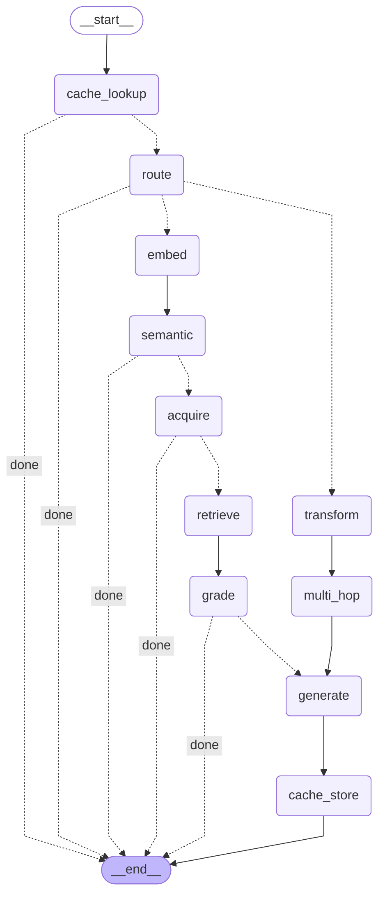

# Architecture

Live graph of the atlas-rag query pipeline (auto-generated by
`scripts/export_graph.py` from the compiled LangGraph — do not edit by hand;
CI fails when this file is stale).

```mermaid
---
config:
  flowchart:
    curve: linear
---
graph TD;
	__start__([<p>__start__</p>]):::first
	cache_lookup(cache_lookup)
	route(route)
	embed(embed)
	semantic(semantic)
	acquire(acquire)
	retrieve(retrieve)
	grade(grade)
	transform(transform)
	multi_hop(multi_hop)
	generate(generate)
	cache_store(cache_store)
	__end__([<p>__end__</p>]):::last
	__start__ --> cache_lookup;
	acquire -. &nbsp;done&nbsp; .-> __end__;
	acquire -.-> retrieve;
	cache_lookup -. &nbsp;done&nbsp; .-> __end__;
	cache_lookup -.-> route;
	embed --> semantic;
	generate --> cache_store;
	grade -. &nbsp;done&nbsp; .-> __end__;
	grade -.-> generate;
	multi_hop --> generate;
	retrieve --> grade;
	route -. &nbsp;done&nbsp; .-> __end__;
	route -.-> embed;
	route -.-> transform;
	semantic -. &nbsp;done&nbsp; .-> __end__;
	semantic -.-> acquire;
	transform --> multi_hop;
	cache_store --> __end__;
	classDef default fill:#f2f0ff,line-height:1.2
	classDef first fill-opacity:0
	classDef last fill:#bfb6fc

```
